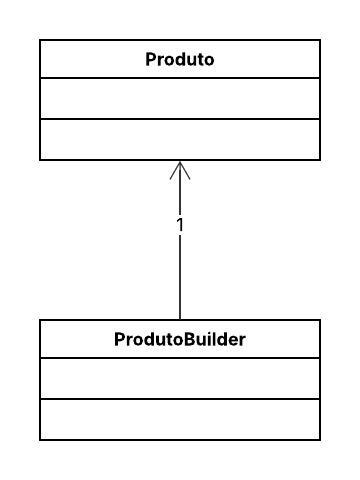

## 📦 Gerenciamento de Produtos

Este projeto demonstra a aplicação do **Padrão de Projeto Builder**.

O objetivo principal do padrão Builder é **separar a construção de um objeto complexo de sua representação**, permitindo que o mesmo processo de construção crie diferentes representações. No nosso cenário de **Gerenciamento de Produtos**, ele resolve o problema de criar instâncias da classe `Produto` que possui muitos atributos opcionais.

-----

## 📌 Diagrama de Classes

-----

## 👩‍💻 Autora

Eduarda Araujo Carvalho
